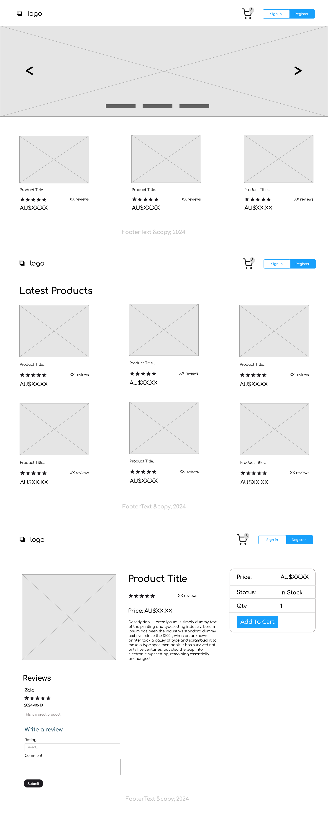
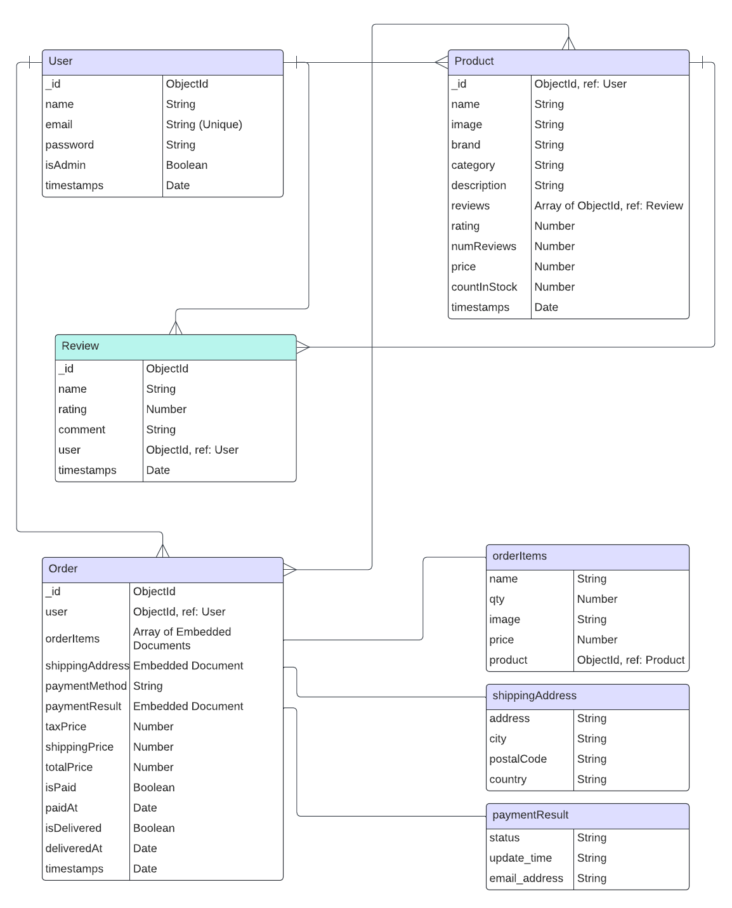

# Title

Tiny Treasures

# Description

Tiny Treasures is a comprehensive full-stack application designed to offer parents and caregivers a delightful shopping experience for baby products. Our platform provides a wide range of high-quality, adorable, and essential items to cater to the needs of your little ones. From stylish clothing and engaging toys to must-have nursery essentials, Tiny Treasures is your one-stop shop for all things baby.

# Website Url

[Tiny Treasures](https://tiny-treasures-zala.onrender.com/)

# Wireframe

# Application screenshots

# Entity Relationship Diagram

User to Product: One-to-Many 
(A User can create many Products)

User to Review: One-to-Many 
(A User can create many Reviews)

User to Order: One-to-Many 
(A User can place many Orders)

Product to Review: One-to-Many 
(A Product can have many Reviews)

Order to Product: Many-to-One 
(An Order contains many Products, each Product can belong to multiple Orders)

# Technologies used

- HTML5
- CSS3
- JavaScript
- React.js
- Express.js
- Bootstrap
- JWT
- MongoDB
- Redux / Redux Toolkit

# User story

As a user,

- I want to see featured products on the homepage so that I can easily find popular or recommended items.
- I want to see a list of all available products so that I can browse through the inventory.
- I want to see the details of a product when I click on it so that I can get more information before making a purchase decision.
- I want to be able to log in using my email address and password so that I can access my account and manage my orders.
- I want to be able to add items to my cart so that I can purchase them later.
- I want to see the items in my cart so that I can review my selections before checking out.
- I want to search products from the homepage so I can easily find the product.

As an admin,

- I want to have a page on the client side where I can control product data, including adding, editing, updating, and deleting products, so that I can manage the inventory effectively.

# Future Enhancement

As a user,

- I want to be able to pay for my items using PayPal or Stripe so that I can choose a payment method that is convenient for me.
- I want to receive an order receipt via email after making a payment so that I have a record of my purchase.
- I want to be able to track my order so that I can know the status and estimated delivery time of my purchase.
- I want to have access to live chat support so that I can get immediate assistance with any questions or issues I may have.

As an admin,

- I want to have pagination on the product management page so that I can easily navigate through a large number of products.
